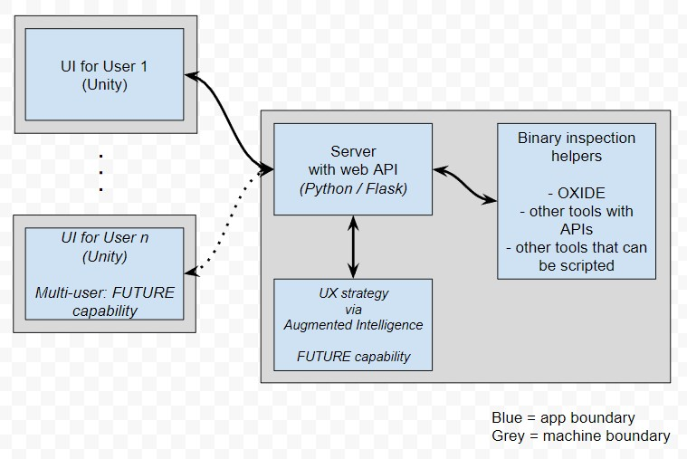

# cogbre-vr

"cogbre" = Cognitive Binary Reverse Engineering

NOTE: This is the VR component for "cogbre." The nexus (server) component is at https://github.com/AugCogVR/cogbre-nexus

This application supports research of the Auburn CSSE Program Understanding Lab (PUL). 

This is a Unity-based front-end to provide an immersive and egocentric experience for those who perform reverse engineering on binary programs. 

Built and tested with the Unity 2021.3.4f1 LTS editor.

# Setup

## HTC Vive

This app (so far) is designed for the HTC Vive Pro. This is what I had to do to make things work. YMMV.

- To prevent SteamVR Home from starting instead of the Unity VR app: SteamVR -> Settings -> (enable Advanced Settings) -> SteamVR Home OFF
- To set up SteamVR to work with OpenXR: SteamVR -> Settings -> Developer -> Current OpenXR Runtime: SteamVR
- To add support for HTC Vive controllers, in Unity Project Settings, ensure in XR Plug-in Management -> OpenXR to add Interaction Profile for HTC Vive Controller 
- If SteamVR insists on a room setup too often, a solution seems to be to manually run Vive Console to start SteamVR before doing VR stuff. See https://steamcommunity.com/app/250820/discussions/0/3040480988282735041/ 

## XR Device Simulator

- Right click it -> Toggle Active State to turn it on and off.
- Refs: 
  - https://docs.unity3d.com/Packages/com.unity.xr.interaction.toolkit@2.0/manual/xr-device-simulator.html 
  - https://blog.immersive-insiders.com/xr-simulator/ 

## Running it

Set up and start the Nexus: https://github.com/AugCogVR/cogbre-nexus

NOTE: For now, the VR component is hardcoded to look for the server on 127.0.0.1

Load the VR project into Unity and run it

# Architecture

The fundamental concepts behind this architecture are:
- The "heavy lifting" happens in the Server (Nexus) component 
- The VR component periodically polls the Server for updates
- The VR experience runs with minimal interruption to ensure a high frame rate
- The Server can take advantage of the myriad Python packages to support various anticipated operations

# Design

The bulk of the custom-developed code and components is in Assets/PUL. Some custom items are in Assets/Resources. 

## Main Loop / Game Manager

We use the "Game Manager" pattern, inspired by https://bronsonzgeb.com/index.php/2021/04/24/unity-architecture-pattern-the-main-loop/

See Assets/PUL/Managers/GameManager for code

The basic idea is: new objects in the world are registered with the Game Manager. The Unity engine calls `GameManager.Update`, and that method calls the Start and Update methods of the other objects in the world (rather than the Unity engine). In those objects, the methods are named `OnStart` and `OnUpdate`. 

## Data Exchange

We connect to the Nexus using its RESTful API, inspired by https://www.red-gate.com/simple-talk/development/dotnet-development/calling-restful-apis-unity3d/

The GameManager creates a NexusClient (see Assets/PUL/DataClients/NexusClient). 

The NexusClient periodically polls the server for updates using a separate thread to avoid delaying the Unity game loop. Inspired by https://www.red-gate.com/simple-talk/development/dotnet-development/calling-restful-apis-unity3d/ 

## Visualization Components

The various components, behaviors, etc. that can/will be used to create the visualization are in Assets/PUL/VizComponents. Right now, it's a set of very basic and not particularly practical things mainly thrown together to get comfortable with how Unity works. 

